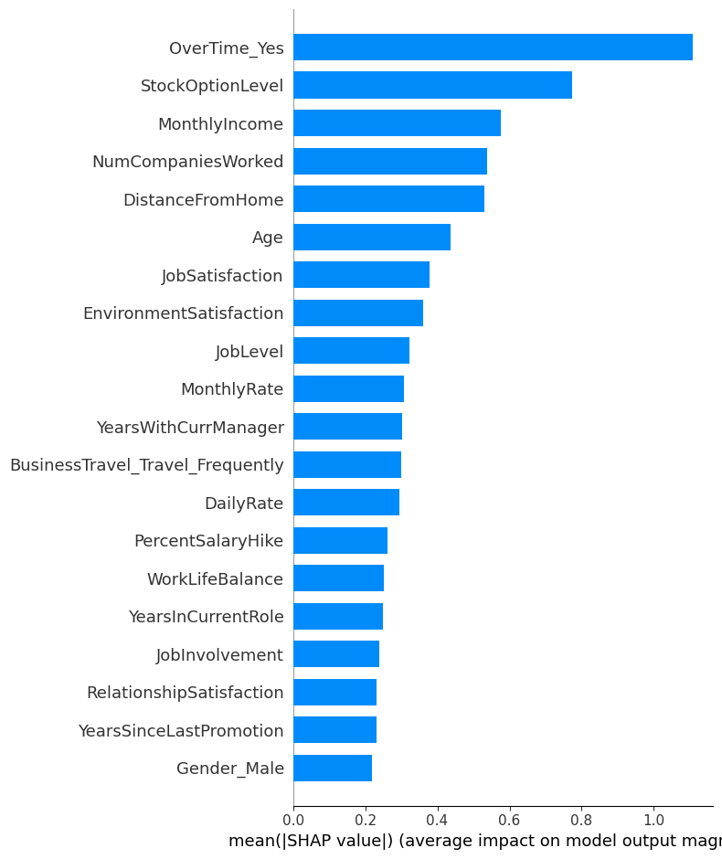
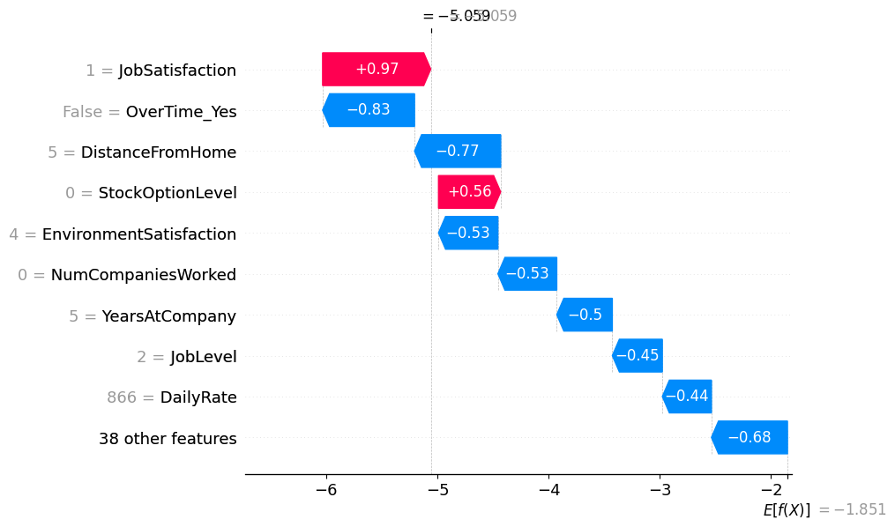

# HR Analytics – Employee Attrition Prediction

This project focuses on understanding why employees leave a company and predicting future attrition using data analysis and machine learning. The goal is to support HR teams with insights that help retain talent and reduce turnover costs.

---

## Objectives

- Perform exploratory data analysis on HR data
- Identify key factors driving attrition (e.g., salary, promotions, overtime)
- Build a classification model to predict attrition
- Use SHAP for model explainability
- Create an interactive Power BI dashboard for HR decision-making

---

## Tools & Technologies

- **Python** Pandas, Seaborn, Scikit-learn, SHAP
- **Power BI** interactive dashboard
- **Jupyter Notebook** for EDA & modeling

---

## Key Features

- Cleaned and processed a real-world HR dataset
- EDA visualizations showing patterns in attrition
- Trained ML models (Logistic Regression, XGBoostClassifier)
- Model evaluation (Accuracy, Confusion Matrix, Classification Report)
- SHAP values to explain individual predictions
- Power BI dashboard with filters by department, salary band, gender, etc.

---

## Sample Insights

- Employees with low income and no promotions are more likely to leave
- Overtime has a strong correlation with attrition
- Sales and HR departments show higher turnover compared to R&D

---

## Deliverables

- Python Notebook: EDA, preprocessing, model training
- Power BI `.pbix` dashboard
- PDF: Attrition Prevention Suggestions (insight-based recommendations)
- Trained ML model (`.pkl`) + SHAP explanation visuals

## SHAP Visualizations

### Feature Importance (Summary Plot)

### Individual Prediction Explanation (Waterfall Plot)

